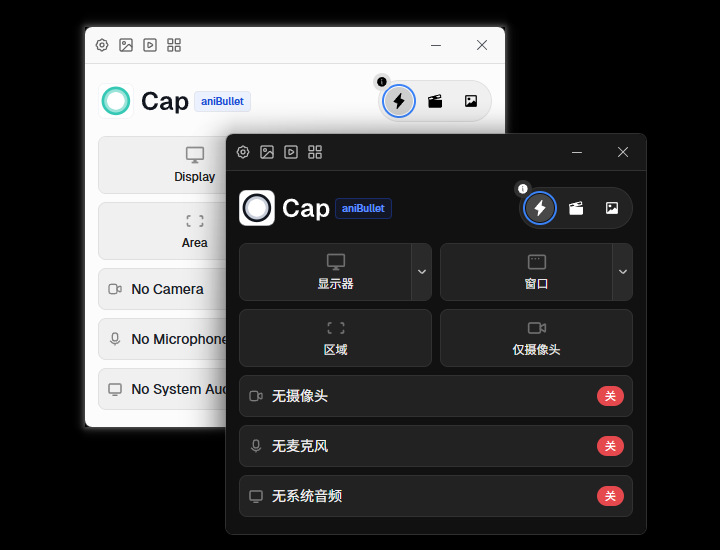

<div align="center">


# Cap - aniBullet Edition

[](LICENSE)
[](https://github.com/aniBullet/Cap-aniBullet/releases)
[](https://www.rust-lang.org)
[](https://nodejs.org)

**专为本地录制设计的专业屏幕录制工具**

无时长限制 • 无云端依赖 • 完全免费 • 本地 AI 字幕 • 多语言支持

[快速开始](#-快速开始) • [特性](#-核心特性) • [下载](https://github.com/aniBullet/Cap-aniBullet/releases) • [开发指南](#-贡献指南)

---

### 主界面预览



</div>

---

## 🌟 核心特性

### 🎯 为本地设计
- **完全离线运行** - 所有数据存储在本地，无需联网（除软件更新）
- **隐私至上** - 录制内容永不上传，完全掌控在您手中
- **SQLite 数据库** - 轻量级本地数据管理，无需服务器

### 🚀 无限制录制
- **无时长限制** - 想录多久录多久
- **无数量限制** - 存储空间是唯一限制
- **完全免费** - 所有功能开箱即用

### 🎬 专业功能
- **多种录制模式** - 全屏、窗口、区域、仅摄像头
- **工作室模式** - 专业时间轴编辑、裁剪、特效
- **本地 AI 字幕** - Whisper.cpp 支持 99+ 语言
- **截图编辑器** - 注释、裁剪、美化一步到位
- **高质量导出** - MP4 (H.264/H.265)、GIF、多种预设
- **多语言界面** - 内置中文、英语、日语、韩语，支持扩展

---

## 🚀 快速开始

<details>
<summary>点击展开</summary>

### Windows 一键脚本

```powershell
# 1. 安装依赖（首次运行）
.\1-install.ps1

# 2. 启动开发服务器
.\2-dev.ps1

# 3. 构建发布版本
.\3-build.ps1
# 选项 1: Development（开发版 - Cap - Development）
# 选项 2: Production（生产版 - Cap，推荐用于发布）
```

**构建版本说明**：
- **Development** (`Cap aniBullet - Development`)：开发版本，标识为 `so.cap.desktop.anibullet.dev`
- **Production** (`Cap aniBullet`)：生产版本，标识为 `so.cap.desktop.anibullet`，用于正式发布

### 手动安装

```bash
# 安装依赖
pnpm install

# 启动开发
cd apps/desktop && pnpm dev

# 构建 - 开发版
cd apps/desktop && pnpm build:tauri

# 构建 - 生产版
cd apps/desktop && pnpm build:tauri --config src-tauri/tauri.prod.conf.json
```

**打包文件位置**：
- Windows: `apps/desktop/src-tauri/target/release/bundle/nsis/Cap_aniBullet_*.exe` (推荐)
- Windows: `apps/desktop/src-tauri/target/release/bundle/msi/cap-anibullet_*.msi`
- macOS: `apps/desktop/src-tauri/target/release/bundle/dmg/Cap_aniBullet_*.dmg`
- Linux: `apps/desktop/src-tauri/target/release/bundle/deb/cap-anibullet_*.deb`

**系统要求**：Node.js 20+ • Rust 1.88+ • FFmpeg

</details>

---

## 🎯 aniBullet 版 vs 原版对比

| 特性 | Cap 原版 | aniBullet 本地版 |
|------|---------|----------------|
| **录制时长** | 免费版限 5 分钟 | ✅ 无限制 |
| **视频数量** | 免费版限 25 个 | ✅ 无限制 |
| **数据存储** | 云端存储 | 🏠 完全本地 |
| **在线分享** | 一键分享 | 🏠 本地专注 |
| **用户账号** | 需要注册登录 | 🏠 无需账号 |
| **付费订阅** | Pro 功能需付费 | ✅ 全功能免费 |
| **AI 字幕** | 云端 API（需付费） | ✅ 本地 Whisper |
| **隐私性** | 上传至云端 | ✅ 数据不出本地 |
| **离线使用** | 需联网 | ✅ 完全离线 |
| **界面语言** | 英语 | ✅ 中英日韩 + 可扩展 |

> **设计理念**：aniBullet 版专注于**本地录制工作流**，移除所有云端依赖，打造纯净、高效、注重隐私的专业录制工具。

---

## 💡 适用场景

- 🎓 **教学录制** - 无时长限制，本地存储安全
- 💼 **企业内部** - 敏感内容不上传云端
- 🎮 **游戏录制** - 高帧率，长时间录制无压力
- 🐛 **Bug 复现** - 快速截图标注，本地保存
- 📹 **内容创作** - 专业编辑工具，导出灵活

---

## 🛠️ 技术架构

- **前端**: SolidJS + TypeScript + TailwindCSS
- **后端**: Rust + Tauri 2.0
- **数据库**: SQLite (本地)
- **视频处理**: FFmpeg
- **AI 引擎**: Whisper.cpp (本地)
- **跨平台**: Windows / macOS / Linux

---

## 📖 文档

- 🔧 [开发规范](CLAUDE.md) - AI 助手开发指南
- 📋 [代码风格](AGENTS.md) - 项目代码规范
- 🤝 [贡献指南](CONTRIBUTING.md) - 如何参与贡献

---

## 🤝 贡献指南

欢迎提交 Issue 和 Pull Request！

在贡献前请阅读：
- [CLAUDE.md](CLAUDE.md) - AI 助手开发指南
- [AGENTS.md](AGENTS.md) - 代码规范

---

## 📄 开源协议


**AGPL-3.0** - 与原 [Cap](https://github.com/CapSoftware/Cap) 项目保持一致

<details>
<summary>点击展开</summary>

<br>

本项目是基于原 [Cap](https://github.com/CapSoftware/Cap) 项目的合法修改版本，完全遵守 AGPL 3.0 协议


- ✅ 保留原始 AGPL 3.0 协议
- ✅ 公开完整修改后的源代码
- ✅ 明确标注修改内容（移除云端功能，增强本地特性）
- ✅ 符合 AGPL 3.0 第 5 条关于传播修改版本的所有要求

部分 Rust crates（`cap-camera*`、`scap-*` 系列）采用 MIT 协议，详见各模块的 LICENSE 文件。

> **法律声明**：根据 AGPL 3.0 协议条款，任何人都有权修改和重新分发开源软件。aniBullet 版专注于本地录制工作流，移除云端依赖是合法的功能调整，并非对原项目的侵权。

</details>

---

## 🙏 致谢

本项目基于优秀的开源项目 [Cap](https://github.com/CapSoftware/Cap) 改造。

感谢 [Cap](https://github.com/CapSoftware/Cap) 团队和所有开源贡献者！

---

<div align="center">

**用本地化的力量，掌控你的录制**

[⭐ Star this repo](https://github.com/aniBullet/Cap-aniBullet) • [📥 Download](https://github.com/aniBullet/Cap-aniBullet/releases) • [🐛 Report Bug](https://github.com/aniBullet/Cap-aniBullet/issues)

---

## ☕ 支持项目

<details>
<summary>点击展开</summary>

<p align="center">
  <br>
  如果这个项目对你有帮助，可以请作者喝杯咖啡 ☕
  <br><br>
</p>

<div align="center">
  
  <br>
  <sub>微信 WeChat</sub>
</div>

<p align="center">
  <br>
  <sub>⭐ 或者给个 Star，也是极大的鼓励！</sub>
</p>

</details>

</div>
