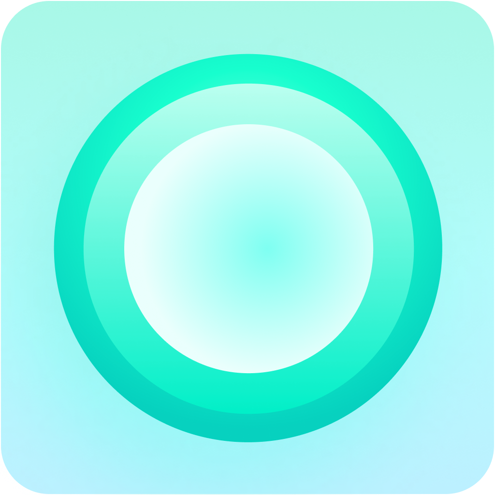
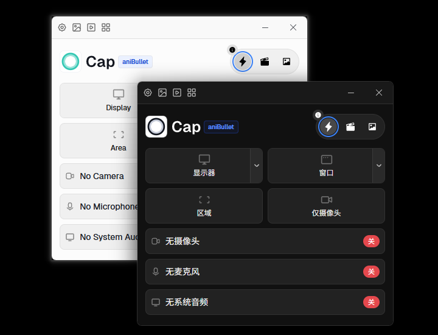

<div align="center">



# Cap - aniBullet Edition

[](LICENSE)
[](https://github.com/aniBullet/Cap-aniBullet/releases)
[](https://github.com/aniBullet/Cap-aniBullet/releases)
[](https://www.rust-lang.org)
[](https://nodejs.org)

**Cap aniBullet — 无时长限制、无账号、无云端、完全免费**

[📥 下载](https://github.com/aniBullet/Cap-aniBullet/releases) • [快速开始](#-快速开始) • [更新日志](#-更新日志) • [贡献](#-贡献)



</div>

---

## 和原版的区别

| 特性 | Cap 原版 | aniBullet 本地版 |
|------|---------|----------------|
| 录制时长 | 免费版限 5 分钟 | ✅ 无限制 |
| 视频数量 | 免费版限 25 个 | ✅ 无限制 |
| 数据存储 | 云端 | 🏠 本地 SQLite |
| 用户账号 | 必须注册 | 🏠 不需要 |
| 付费订阅 | Pro 功能需付费 | ✅ 全功能免费 |
| AI 字幕 | 云端 API（付费） | ✅ 本地 Whisper.cpp |
| 视频压缩 | 云端处理 | ✅ 本地 HEVC |
| 键盘 Overlay | — | ✅ 实时按键显示 |
| 离线使用 | 需联网 | ✅ 完全离线 |
| 界面语言 | 英语 | ✅ 中 / 英 / 日 / 韩 |

---

## 功能

- **多种录制模式** — 全屏、窗口、区域（工具条锁定在录制区旁）、仅摄像头
- **Studio 工作室** — 时间轴编辑、裁剪、渐变编辑器
- **键盘 Overlay** — 实时显示按键，教学录制专属
- **字幕时间轴** — 可视化字幕编辑，精准对齐视频
- **本地 AI 字幕** — Whisper.cpp，支持 99+ 语言，完全离线
- **HEVC 压缩** — 库内右键一键压缩，原版 / 压缩版随时切换
- **高质量导出** — MP4 (H.264/H.265)、GIF、智能 CRF 模式
- **截图编辑器** — 注释、裁剪、美化

---

## 🚀 快速开始

```powershell
.\scripts\1-install.ps1  # 安装依赖（首次，完成后重启终端）
.\scripts\2-dev.ps1      # 开发模式
.\scripts\3-build.ps1    # 构建安装包
```

详细步骤见 [BUILD.md](BUILD.md)。

---

## 📋 更新日志

> 完整历史见 [CHANGELOG.md](CHANGELOG.md)

**v2.2.0** — 删除 OAuth / 水印 Shader / 商业授权 / 付费限时残留代码，移除 mysql2 依赖。

**v2.1.0** — HEVC 压缩、原版 / 压缩版管理、智能 CRF 导出、快速录制自动压缩。

**v2.0.x** — Studio GPU 编码（消除马赛克）、区域录制工具条修复、上游同步 v0.4.81。

---

## 🛠️ 技术栈

SolidJS + TypeScript + TailwindCSS • Rust + Tauri 2.0 • SQLite • FFmpeg + MediaFoundation • Whisper.cpp • Windows x64

---

## 贡献

欢迎 Issue 和 PR，提交前请阅读 [CONTRIBUTING.md](CONTRIBUTING.md)。

---

## 协议

**AGPL-3.0**，基于 [Cap](https://github.com/CapSoftware/Cap) v0.4.81。

<details>
<summary>详情</summary>

本项目完全遵守 AGPL 3.0 协议：保留原始协议、公开源代码、明确标注修改内容。

部分 crates（`cap-camera*`、`scap-*`）采用 MIT 协议，详见各模块 LICENSE 文件。

</details>

---

## 致谢

基于 [Cap](https://github.com/CapSoftware/Cap) 改造，感谢 Cap 团队和所有贡献者。

---

<div align="center">

[⭐ Star](https://github.com/aniBullet/Cap-aniBullet) • [📥 下载](https://github.com/aniBullet/Cap-aniBullet/releases) • [🐛 反馈](https://github.com/aniBullet/Cap-aniBullet/issues)

<details>
<summary>☕ 支持作者</summary>

<br>

如果有帮助，可以请作者喝杯咖啡 ☕ 或者给个 Star ⭐

<div align="center">
  
  <br>
  <sub>微信 WeChat</sub>
</div>

</details>

</div>
